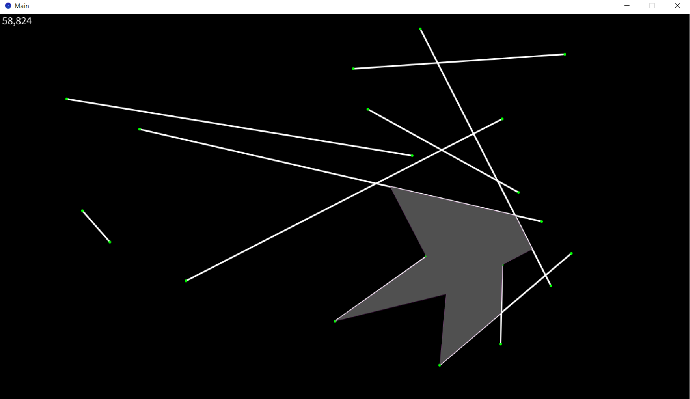
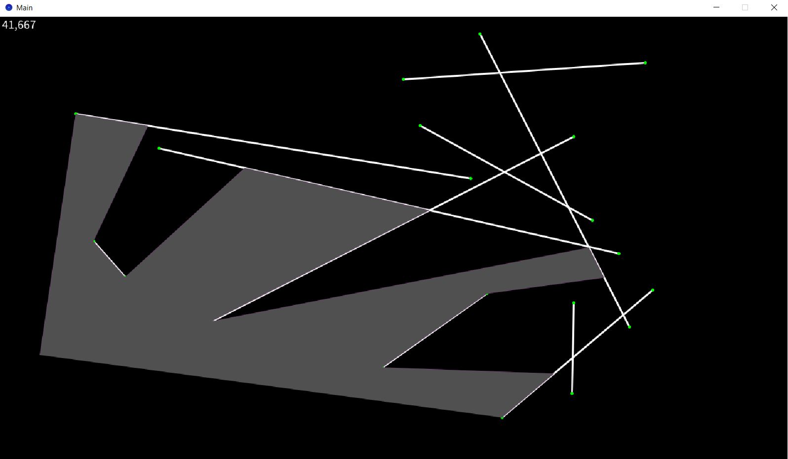
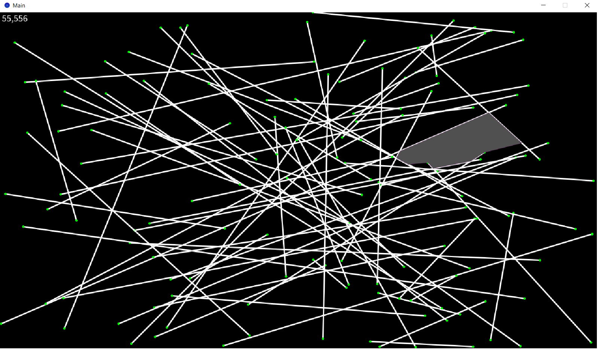

# RayTracing
This is a demo of an algorithm that performs near pixel-perfect ray casting in a 2D world with only line segments as obstacles. The visualization is done with the help of the [Processing](https://processing.org/) framework. The algorith is inspired by the [Bentley–Ottmann](https://en.wikipedia.org/wiki/Bentley%E2%80%93Ottmann_algorithm) algorithm for line-segment intersection. For simplicity the rays going into the void are not rendered.

|  | | |
|--|--|--|
|  |  |  |
